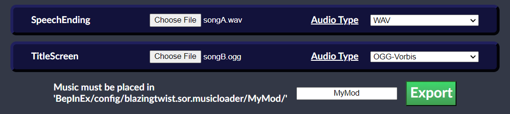
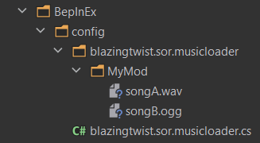
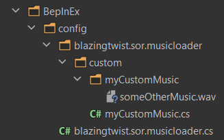
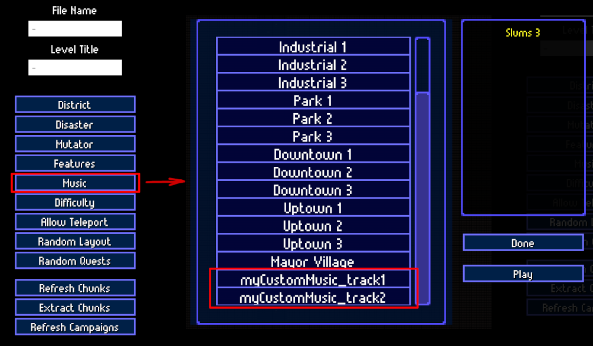

# Replacing In-game Music
The default config comes with keys to replace all in-game tracks, as well as documentation that should be enough to get you started.  
You can find it in `BepInEx/config/blazingtwist.sor.musicloader.cs` (I recommend opening it with notepad++, which will automatically use decent looking syntax-highlighting)  

On MPEG: Unity no longer supports mp3 streaming, so any mp3 files will be converted to wav in memory.  
It is advisable to convert your mp3 files to .wav or .ogg to reduce loading-times.

There's 24 tracks you can replace:
* `Level1_1` - Slums 1
* `Level1_2` - Slums 2
* `Level1_3` - Slums 3
* `Level2_1` - Industrial 1
* `Level2_2` - Industrial 2
* `Level2_3` - Industrial 3
* `Level3_1` - Park 1
* `Level3_2` - Park 2
* `Level3_3` - Park 3
* `Level4_1` - Downtown 1
* `Level4_2` - Downtown 2
* `Level4_3` - Downtown 3
* `Level5_1` - Uptown 1
* `Level5_2` - Uptown 2
* `Level5_3` - Uptown 3
* `Level6` - Mayor Village
* `Intro_Loop`
* `Track_A_Tutorial_Start`
* `Home_Base_v2` - Home Base
* `Track_Hype_v4`
* `Credits`
* `SpeechMain`
* `SpeechEnding`
* `TitleScreen`

<br/>

# Using the Config Builder GUI

The GUI lets you select a File for each of the default tracks.  
You will need to specify a name for your mod (e.g. 'MyMod') and then place your songs in the corresponding Directory. In this case: `BepInEx/config/blazingtwist.sor.musicloader.cs/MyMod/`.

For example, if your GUI looks like this:



Then you should have your files organized like this:



<br/>

# Adding Your Own Music (For Modders)
If replacing the existing music isn't enough for you, it's also possible to specify custom music by making use of either the Api-Methods or Mod-Configs

### **Mod-Configs**

Mod-Configs allow you to add custom music without writing your own mod.  
Custom music added this way requires a config-file in `[...]/BepInEx/config/blazingtwist.sor.musicloader/custom/`  
Config-files must have a `.cs` extension. A config-file `myCustomMusic.cs` may look like this:
```c#
- trackList :

-- "track1" :
--- audioType = MPEG
--- filePath = "C:/Music/someMusic.mp3"

-- "track2" :
--- audioType = WAV
--- filePath = "someOtherMusic.wav"
```
In this case `track1` uses an absolute path, which works as you'd expect.  
But `track2` is using a relative path. The musicLoader will look for track2 in
`[...]/blazingtwist.sor.musicloader/custom/myCustomMusic/someOtherMusic.wav`  
As such, if you want to use relative paths, you'll need to create a directory of the **same name** as your config-file.

Specifically, this is what your folder structure should look like now:



*note: you'll have to create the 'custom' folder and its contents manually*

Now you can use your music for your custom Levels like this:



Absolute paths are intended to ease development. When sharing your mod, you **absolutely should** use relative paths.

---

### **Api-Methods**
Api-Methods allow your mod to take control over how music is loaded from the disk.  
Want to use a non-standard location or bundle your music in another format? You can.

For specific documentation on Api-Methods, check the `SoR_Music_Loader.music_loader.api.BTMusicLoader` class.

Some basic examples:

* `(MusicLoadResult, AudioClip) LoadMusic(string, AudioType, string)`  
    The least involved way to load and add music to the game.  
    Appropriate when you only care about using your Music's AudioClip in your mod.
    ```c#
    (MusicLoadResult status, AudioClip clip) = BTMusicLoader.LoadMusic("myMod_track1", AudioType.WAV, "C:/Music/track1.wav");
    if(status == MusicLoadResult.Success) {
        // use AudioClip to do something
    }
    ```
  
* `IEnumerator LoadMusicAsync(string, AudioType, string, Action<MusicLoadResult, AudioClip>)`  
    Equivalent to the basic `LoadMusic` method, but executes asynchronously.  
    Should be used whenever you don't need the AudioClip immediately.
    ```c#
    StartCoroutine(BTMusicLoader.LoadMusicAsync("myMod_track2", AudioType.MPEG, "track2.mp3", (status, clip) => {
        if(status == MusicLoadResult.Success) {
            // use AudioClip to do something
        }
    });
    ```
  
* `MusicLoadResult AddMusic(string, AudioClip)`  
    This allows you the most control over your music, but also means you'll have to load it yourself.  
    Useful when you already have a loaded AudioClip and want to register it as playable music.
    ```c#
    AudioClip someClip = ...
    MusicLoadResult result = BTMusicLoader.AddMusic("myMod_track3", someClip);
    if(result != MusicLoadResult.Success){
        // Something went wrong, music won't be available in game
    }
    ```
  
* `AudioClip Mp3ToWavClip(byte[])`  
    If you want to play mp3 Audio, you'll have to convert it to another format first.  
    Rather than creating your own method to do so, you can use this one.
    To get a byte[] of your file you can make use of
    Unity's `UnityWebRequest` (see `TrackLoadingUtils.LoadMusicTrack` for reference)
    or use `System.IO.File.ReadAllBytes`
    ```c#
    byte[] mp3Data = File.ReadAllBytes("C:/Music/track4.mp3");
    AudioClip clip = BTMusicLoader.Mp3ToWavClip(mp3Data);
    // use AudioClip to do something
    ```

<br/>

# About the Config-Language
It's basically YAML, except
* indentations are replaced with `-`
* Any whitespace is ignored unless it is enclosed in `"<whitespace here>"`
* `=` indicates assignment of a simple value. For example:  
    c# `int someVal = 100;`  
    corresponds to config `- someVal = 100`
* `:` indicates assignment of a List, Dictionary or Object. For example:  
    c#
    ```c#
    Dictionary<string, List<string>> someDict = new Dictionary<string, List<string>> {
            { "key1", new List<string> { "key1_val1", "key1_val2" } },
            { "key2", new List<string> { "key2_val1", "key2_val2" } }
    };
    ```  
    corresponds to config
    ```
    - someDict :
    -- key1 :
    --- key1_val1
    --- key1_val2
    -- key2 :
    --- key2_val1
    --- key2_val2
    ```
